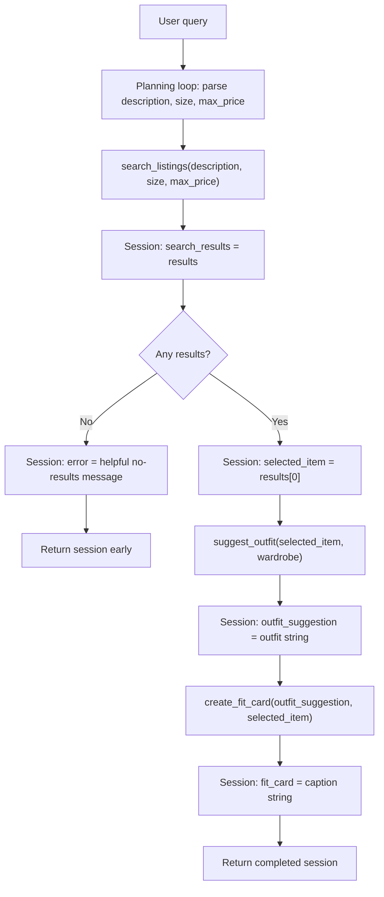

# FitFindr - planning.md

## Tools

### Tool 1: search_listings

**What it does:**
Searches the local secondhand listings dataset for items that match the user's item description, optional size filter, and optional maximum price. It is deterministic and does not call the LLM.

**Input parameters:**
- `description` (str): Keywords describing the item or style the user wants, such as "vintage graphic tee" or "black combat boots".
- `size` (str | None): Optional size filter. Matching is case-insensitive and substring-based so "M" can match "S/M" or "M/L".
- `max_price` (float | None): Optional inclusive price ceiling.

**What it returns:**
A list of listing dictionaries sorted by relevance, highest scoring first. Each listing contains `id`, `title`, `description`, `category`, `style_tags`, `size`, `condition`, `price`, `colors`, `brand`, and `platform`.

**What happens if it fails or returns nothing:**
It returns an empty list, not an exception. The planning loop sets `session["error"]` to a helpful message and returns early without calling `suggest_outfit` or `create_fit_card`.

### Tool 2: suggest_outfit

**What it does:**
Uses Groq `llama-3.3-70b-versatile` to turn the selected listing and the user's wardrobe into 1-2 concrete outfit ideas. If the wardrobe is empty, it gives general styling advice for the item instead of naming closet pieces.

**Input parameters:**
- `new_item` (dict): The selected listing dict from `search_listings`, usually `results[0]`.
- `wardrobe` (dict): A wardrobe dict with an `items` list. Each item can include `id`, `name`, `category`, `colors`, `style_tags`, and `notes`.

**What it returns:**
A non-empty string with outfit advice. With an example wardrobe, it names specific pieces such as baggy jeans, combat boots, or a crossbody bag. With an empty wardrobe, it names categories and styling directions instead.

**What happens if it fails or returns nothing:**
For an empty wardrobe, the tool still returns general advice. If the LLM call is unavailable, the tool returns a fallback styling string that includes the selected item and a note that LLM styling was unavailable.

### Tool 3: create_fit_card

**What it does:**
Uses Groq `llama-3.3-70b-versatile` to turn the outfit suggestion and selected listing into a short, shareable social caption.

**Input parameters:**
- `outfit` (str): The outfit suggestion returned by `suggest_outfit`.
- `new_item` (dict): The selected listing dict from `search_listings`.

**What it returns:**
A 2-4 sentence caption string that mentions the item title, price, platform, and outfit vibe.

**What happens if it fails or returns nothing:**
If `outfit` is empty or whitespace, it returns a descriptive error string and does not call the LLM. If the LLM call is unavailable, it returns a simpler fallback caption using the item and outfit details.

### Additional Tools

No additional tools are required.

## Planning Loop

The agent starts with a fresh session dict containing the query, parsed filters, search results, selected item, wardrobe, outfit suggestion, fit card, and error field. It parses the query with regex to extract `max_price` from phrases like "under $30" and `size` from phrases like "size M"; the remaining cleaned text becomes the search `description`.

The first tool call is always `search_listings(description, size, max_price)`. After search returns, the agent checks `results`. If `results == []`, it stores the empty list in `session["search_results"]`, writes an actionable error into `session["error"]`, leaves `selected_item`, `outfit_suggestion`, and `fit_card` as `None`, and returns immediately.

If search returns matches, the agent selects `results[0]`, stores it as `session["selected_item"]`, and calls `suggest_outfit(selected_item, wardrobe)`. The returned string is stored as `session["outfit_suggestion"]`. Finally, the agent calls `create_fit_card(outfit_suggestion, selected_item)`, stores the result as `session["fit_card"]`, and returns the completed session.

## State Management

State is passed through one session dictionary created by `_new_session(query, wardrobe)`. The session stores `query`, `parsed`, `search_results`, `selected_item`, `wardrobe`, `outfit_suggestion`, `fit_card`, and `error`.

Each step reads from and writes to that single session. The selected listing is not re-searched or reconstructed between tools: `session["selected_item"]` is the exact dict passed into both `suggest_outfit` and `create_fit_card`. The Gradio handler reads the final session and maps the selected item, outfit suggestion, and fit card into the three UI panels.

## Error Handling

| Tool | Failure mode | Agent response |
|------|-------------|----------------|
| search_listings | No results match the query | Set `session["error"]` to a message explaining the missing item and suggesting broader search terms, a higher price, or removing size. Return early. |
| suggest_outfit | Wardrobe is empty | Return general styling advice for the selected item instead of naming closet pieces. The agent continues to fit-card generation. |
| create_fit_card | Outfit input is missing or incomplete | Return "Cannot create a fit card yet..." and explain that `suggest_outfit` must run first. |

## Architecture

## AI Tool Plan

**Milestone 3 - Individual tool implementations:**
I will give ChatGPT the Tool 1 spec and ask it to implement `search_listings()` using `load_listings()` rather than reopening the JSON file. I will verify that it filters by price and size before scoring, drops zero-score listings, and returns `[]` for impossible queries. For Tool 2 and Tool 3, I will give ChatGPT the exact specs above plus the Groq model requirement and verify that the generated code uses `GROQ_API_KEY`, handles empty wardrobe or empty outfit strings, and returns strings instead of exceptions.

**Milestone 4 - Planning loop and state management:**
I will give ChatGPT the Planning Loop, State Management, and Architecture sections and ask it to implement `run_agent()` in `agent.py`. I will verify that the generated code branches after `search_listings`, stores all intermediate values in the session dict, and does not call `suggest_outfit` after an empty search result. I will then use the same state fields to implement `handle_query()` in `app.py`.

## A Complete Interaction (Step by Step)

**Example user query:** "I'm looking for a vintage graphic tee under $30. I mostly wear baggy jeans and chunky sneakers. What's out there and how would I style it?"

**Step 1:**
The agent parses the query into `description="vintage graphic tee baggy jeans chunky sneakers"`, `size=None`, and `max_price=30.0`. It calls `search_listings(description, size=None, max_price=30.0)`. The tool searches listing titles, descriptions, categories, tags, colors, size, brand, and platform, then returns matching listings sorted by relevance.

**Step 2:**
The agent checks whether search returned anything. If the top result is `Vintage Band Tee - Faded Grey` or another graphic tee under $30, the agent stores that listing in `session["selected_item"]`. It calls `suggest_outfit(selected_item, wardrobe)` using the user's wardrobe dict.

**Step 3:**
`suggest_outfit` returns an outfit idea that uses the new tee with named wardrobe pieces such as baggy straight-leg jeans and chunky white sneakers or black combat boots. The agent stores that text in `session["outfit_suggestion"]`, then calls `create_fit_card(outfit_suggestion, selected_item)`.

**Final output to user:**
The UI shows the selected listing in the first panel, the outfit suggestion in the second panel, and a short social caption in the third panel. If Step 1 returned no listings, the first panel instead shows a helpful no-results message and the other panels remain empty.
